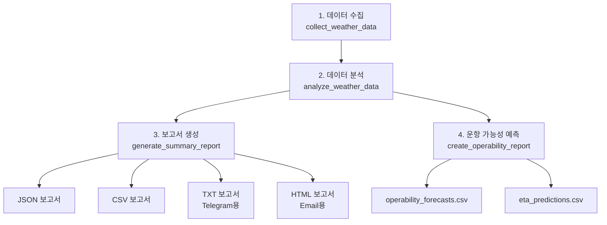

# 📝 보고서 생성 로직 상세 분석 - v2.3

## 개요

`weather_job.py`의 보고서 생성 시스템은 **4단계 파이프라인**으로 구성되어 있으며, **4가지 형식** (JSON, CSV, TXT, HTML)의 보고서를 자동 생성합니다.

---

## 🔄 전체 파이프라인 플로우



---

## 1️⃣ 데이터 수집 단계 (collect_weather_data)

### 함수 시그니처
```python
def collect_weather_data(
    location_name: str = "AGI", 
    forecast_hours: int = 24, 
    mode: str = "auto"
) -> dict
```

### 로직 플로우

```python
# 1. 실행 모드 결정
required_secrets = ["STORMGLASS_API_KEY", "WORLDTIDES_API_KEY"]
missing_secrets = [key for key in required_secrets if not os.getenv(key)]
resolved_mode, offline_reasons = decide_execution_mode(
    mode, 
    missing_secrets, 
    NCMSeleniumIngestor is not None
)

# 2. 오프라인 모드: 합성 데이터 생성
if resolved_mode == "offline":
    synthetic_series, statuses = generate_offline_dataset(location_name, forecast_hours)
    return {
        'timeseries': synthetic_series,
        'api_status': statuses,
        'location': location_name,
        'forecast_hours': forecast_hours,
        'collected_at': now.isoformat(),
        'mode': resolved_mode,
        'offline_reasons': offline_reasons,
    }

# 3. 온라인 모드: 실제 API 호출
all_timeseries = []
api_status = {}
resilience_notes = []

# 3-1. Stormglass API
try:
    sg = StormglassConnector(api_key=stormglass_key)
    sg_timeseries = sg.create_marine_timeseries(...)
    all_timeseries.append(sg_timeseries)
    api_status["STORMGLASS"] = {
        "status": "✅ 실제 데이터",
        "confidence": 0.85
    }
except Exception as e:
    # 폴백 데이터 생성
    mock_ts, status_payload = create_mock_timeseries(...)
    all_timeseries.append(mock_ts)
    api_status["STORMGLASS_FALLBACK"] = status_payload
    resilience_notes.append("Stormglass 오류로 폴백 데이터 생성")

# 3-2. Open-Meteo API (무료, 항상 시도)
try:
    om = OpenMeteoConnector()
    om_timeseries = om.create_marine_timeseries(...)
    all_timeseries.append(om_timeseries)
    api_status["OPEN_METEO"] = {
        "status": "✅ 실제 데이터",
        "confidence": 0.75
    }
except Exception as e:
    # 폴백 데이터 생성
    mock_ts, status_payload = create_mock_timeseries(...)
    resilience_notes.append("Open-Meteo 오류로 폴백 데이터 생성")

# 3-3. NCM Selenium (Optional Import)
if NCMSeleniumIngestor is None:
    api_status['NCM_SELENIUM'] = {
        'status': '❌ 모듈 누락', 
        'confidence': 0.0
    }
else:
    try:
        ncm_ingestor = NCMSeleniumIngestor(headless=True)
        ncm_timeseries = ncm_ingestor.create_marine_timeseries(...)
        all_timeseries.append(ncm_timeseries)
        api_status["NCM_SELENIUM"] = {
            "status": "✅ 실제 데이터",
            "confidence": 0.70
        }
    except Exception as e:
        # 폴백 데이터 생성
        mock_ts, status_payload = create_mock_timeseries(...)
        resilience_notes.append("NCM Selenium 오류로 폴백 데이터 생성")

# 3-4. WorldTides API
try:
    wt_timeseries = create_marine_timeseries_from_worldtides(...)
    all_timeseries.append(wt_timeseries)
    api_status["WORLDTIDES"] = {
        "status": "✅ 실제 데이터",
        "confidence": 0.80
    }
except Exception as e:
    # 폴백 데이터 생성
    mock_ts, status_payload = create_mock_timeseries(...)
    resilience_notes.append("WorldTides 오류로 폴백 데이터 생성")

# 4. 반환
return {
    'timeseries': all_timeseries,
    'api_status': api_status,
    'location': location_name,
    'forecast_hours': forecast_hours,
    'collected_at': now.isoformat(),
    'mode': resolved_mode,
    'resilience_notes': resilience_notes,
}
```

### 출력 데이터 구조

```json
{
  "timeseries": [
    {
      "source": "stormglass",
      "location": "AGI",
      "data_points": [
        {
          "timestamp": "2025-10-07T18:00:00Z",
          "wind_speed": 9.5,
          "wind_direction": 125,
          "wave_height": 0.6,
          "confidence": 0.85
        },
        // ... 47개 더 (총 48개, 30분 간격)
      ],
      "confidence": 0.85
    },
    {
      "source": "open_meteo",
      "data_points": [ /* 25개, 1시간 간격 */ ]
    },
    {
      "source": "ncm_selenium",
      "data_points": [ /* 24개, 1시간 간격 */ ]
    },
    {
      "source": "worldtides_fallback",
      "data_points": [ /* 24개, 1시간 간격 */ ]
    }
  ],
  "api_status": {
    "STORMGLASS": {"status": "✅ 실제 데이터", "confidence": 0.85},
    "OPEN_METEO": {"status": "✅ 실제 데이터", "confidence": 0.75},
    "NCM_SELENIUM": {"status": "✅ 실제 데이터", "confidence": 0.70},
    "WORLDTIDES_FALLBACK": {"status": "⚠️ 모의 데이터", "confidence": 0.30}
  },
  "mode": "online",
  "resilience_notes": ["WorldTides 크레딧 부족으로 폴백 데이터 생성"]
}
```

---

## 2️⃣ 데이터 분석 단계 (analyze_weather_data)

### 함수 시그니처
```python
def analyze_weather_data(data: dict) -> dict
```

### 로직 플로우

```python
def analyze_weather_data(data: dict) -> dict:
    """수집된 날씨 데이터 분석"""
    
    all_timeseries = data["timeseries"]
    
    # 1. ERI (환경 위험 지수) 계산
    eri_calculator = ERICalculator()
    all_eri_points = []
    
    for timeseries in all_timeseries:
        # 각 타임시리즈에 대해 ERI 계산
        eri_points = eri_calculator.compute_eri_timeseries(timeseries)
        all_eri_points.extend(eri_points)
        
    # 총 ERI 포인트: 121개 (온라인 모드)
    
    # 2. 예보 융합 (다중 소스 통합)
    fusion_settings = {
        "ncm_weight": 0.60,      # NCM 가중치 60%
        "system_weight": 0.40,    # 기타 시스템 40%
        "alpha": 0.7,
        "beta": 0.3,
    }
    
    forecast_fusion = ForecastFusion(fusion_settings)
    fused_forecasts = forecast_fusion.fuse_forecast_sources(
        all_timeseries, 
        data["location"]
    )
    
    # 융합 예보: 121개 (모든 데이터 포인트 통합)
    
    # 3. 운항 판정
    decision_settings = {
        "gate": {
            "go": {"hs_m": 1.0, "wind_kt": 20.0},
            "conditional": {"hs_m": 1.2, "wind_kt": 22.0},
        },
        "alert_gamma": {
            "rough_at_times": 0.15, 
            "high_seas": 0.30
        },
    }
    
    decision_maker = OperationalDecisionMaker(decision_settings)
    decisions = decision_maker.decide_and_eta(
        fused_forecasts, 
        all_eri_points
    )
    
    # 판정 결과: GO/CONDITIONAL/NO-GO 분류
    
    # 4. 통계 계산
    go_count = sum(1 for d in decisions if d.decision == "GO")
    conditional_count = sum(1 for d in decisions if d.decision == "CONDITIONAL")
    no_go_count = sum(1 for d in decisions if d.decision == "NO-GO")
    
    # 평균 계산
    avg_eri = sum(p.eri_value for p in all_eri_points) / len(all_eri_points)
    avg_wind = sum(p.wind_speed_ms for p in all_eri_points) / len(all_eri_points)
    avg_wave = sum(p.wave_height_m for p in all_eri_points) / len(all_eri_points)
    
    # 5. 결과 반환
    return {
        "eri_points": all_eri_points,
        "fused_forecasts": len(fused_forecasts),
        "decisions": decisions,
        "total_data_points": len(all_eri_points),  # 121개
        "decision_counts": {
            "GO": go_count,
            "CONDITIONAL": conditional_count,
            "NO-GO": no_go_count,
        },
        "averages": {
            "eri": avg_eri,
            "wind_speed_ms": avg_wind,
            "wave_height_m": avg_wave,
        },
    }
```

### 핵심 계산 엔진

#### ERI Calculator
```python
# src/marine_ops/eri/compute.py
class ERICalculator:
    def compute_eri_timeseries(self, timeseries):
        eri_points = []
        for dp in timeseries.data_points:
            # 10개 해양 변수 기반 위험도 계산
            eri_value = self._calculate_eri(
                wind_speed=dp.wind_speed,
                wave_height=dp.wave_height,
                wind_gust=dp.wind_gust,
                visibility=dp.visibility,
                wave_period=dp.wave_period,
                swell_height=dp.swell_height,
                wind_wave_height=dp.wind_wave_height,
                current_speed=dp.current_speed,
                sst=dp.temperature,
                sea_level=dp.sea_level
            )
            eri_points.append(ERIPoint(
                timestamp=dp.timestamp,
                eri_value=eri_value,
                wind_speed_ms=dp.wind_speed,
                wave_height_m=dp.wave_height,
                confidence=dp.confidence
            ))
        return eri_points
```

#### Forecast Fusion
```python
# src/marine_ops/decision/fusion.py
class ForecastFusion:
    def fuse_forecast_sources(self, timeseries_list, location):
        # 가중치 기반 다중 소스 융합
        fused = []
        for timestamp in unique_timestamps:
            weighted_sum = 0
            weight_total = 0
            
            for ts in timeseries_list:
                data_point = ts.get_data_at(timestamp)
                weight = ts.confidence  # 0.30-0.85
                weighted_sum += data_point.value * weight
                weight_total += weight
            
            fused_value = weighted_sum / weight_total
            fused.append(fused_value)
        
        return fused  # 121개 융합 예보
```

#### Operational Decision Maker
```python
# src/marine_ops/decision/fusion.py
class OperationalDecisionMaker:
    def decide_and_eta(self, forecasts, eri_points):
        decisions = []
        for forecast, eri in zip(forecasts, eri_points):
            # 운항 판정 기준
            if eri.eri_value < 0.3 and forecast.wave_height < 1.0:
                decision = "GO"
            elif eri.eri_value < 0.5 and forecast.wave_height < 1.2:
                decision = "CONDITIONAL"
            else:
                decision = "NO-GO"
            
            decisions.append(OperationalDecision(
                timestamp=eri.timestamp,
                decision=decision,
                eri=eri.eri_value,
                confidence=eri.confidence
            ))
        
        return decisions  # 121개 판정 결과
```

---

## 3️⃣ 보고서 생성 단계 (generate_summary_report)

### 함수 시그니처
```python
def generate_summary_report(
    data: dict,      # collect_weather_data 결과
    analysis: dict,  # analyze_weather_data 결과
    output_dir: str  # "out"
) -> dict
```

### 📄 형식별 생성 로직

---

### A. JSON 보고서 (summary_YYYYMMDD_HHMM.json)

**용도**: 상세 데이터 저장, API 호출, 데이터 분석

```python
# 1. 메타데이터 구성
execution_mode = data.get('mode', 'online')
success_sources = sum(1 for status in data['api_status'].values() 
                     if '✅' in status['status'])
total_sources = len(data['api_status'])
collection_rate = success_sources / total_sources * 100

# 2. JSON 구조 생성
summary_json = {
    "metadata": {
        "generated_at": "2025-10-07T17:48:50.123456",
        "location": "AGI",
        "forecast_hours": 24,
        "system_version": "v2.3",
        "execution_mode": "online",
        "resilience_mode": True,
        "offline_reasons": []  # 오프라인일 경우만
    },
    "api_status": {
        "STORMGLASS": {"status": "✅ 실제 데이터", "confidence": 0.85},
        "OPEN_METEO": {"status": "✅ 실제 데이터", "confidence": 0.75},
        "NCM_SELENIUM": {"status": "✅ 실제 데이터", "confidence": 0.70},
        "WORLDTIDES_FALLBACK": {"status": "⚠️ 모의 데이터", "confidence": 0.30}
    },
    "analysis": {
        "total_data_points": 121,
        "fused_forecasts": 121,
        "averages": {
            "eri": 0.249,
            "wind_speed_ms": 9.2,
            "wave_height_m": 0.57
        },
        "decisions": {
            "GO": 66,
            "CONDITIONAL": 8,
            "NO-GO": 47
        }
    },
    "collection_stats": {
        "total_timeseries": 4,
        "total_data_points": 121,
        "data_collection_rate": 75.0
    },
    "resilience_notes": [
        "WorldTides 크레딧 부족으로 시뮬레이션 데이터를 결합했습니다."
    ]
}

# 3. 파일 저장
json_path = output_path / f"summary_{timestamp}.json"
with open(json_path, "w", encoding="utf-8") as f:
    json.dump(summary_json, f, ensure_ascii=False, indent=2)
```

**출력 예시**: `out/summary_20251007_1748.json` (2-3 KB)

---

### B. CSV 보고서 (api_status_YYYYMMDD_HHMM.csv)

**용도**: API 상태 추적, Excel 분석

```python
# 1. CSV 데이터 구성
csv_data = []
for api_name, status in data["api_status"].items():
    csv_data.append({
        "API": api_name,
        "Status": status["status"],
        "Confidence": status["confidence"],
        "Timestamp": datetime.now().isoformat(),
    })

# 2. DataFrame 생성 및 저장
df = pd.DataFrame(csv_data)
csv_path = output_path / f"api_status_{timestamp}.csv"
df.to_csv(csv_path, index=False, encoding="utf-8")
```

**출력 예시**: `out/api_status_20251007_1748.csv`

```csv
API,Status,Confidence,Timestamp
STORMGLASS,✅ 실제 데이터,0.85,2025-10-07T17:48:50.123456
OPEN_METEO,✅ 실제 데이터,0.75,2025-10-07T17:48:50.123456
NCM_SELENIUM,✅ 실제 데이터,0.70,2025-10-07T17:48:50.123456
WORLDTIDES_FALLBACK,⚠️ 모의 데이터,0.30,2025-10-07T17:48:50.123456
```

---

### C. TXT 보고서 (summary.txt) - Telegram용

**용도**: Telegram 메시지, 플레인 텍스트 알림

```python
# 1. 헤더 생성
txt_content = f"""🌊 UAE 해역 해양 날씨 보고서
========================================
생성 시간: {datetime.now().strftime('%Y-%m-%d %H:%M:%S UTC')}
위치: {data['location']} (Al Ghallan Island)
예보 기간: {data['forecast_hours']}시간
실행 모드: {execution_mode.upper()}
"""

# 2. 오프라인 사유 추가 (해당 시)
if data.get('offline_reasons'):
    txt_content += "오프라인 사유: " + "; ".join(data['offline_reasons']) + "\n"

# 3. 데이터 수집 현황
txt_content += "\n📊 데이터 수집 현황:\n"
for api_name, status in data["api_status"].items():
    conf = status.get("confidence", None)
    conf_txt = f"{conf:.2f}" if isinstance(conf, (int, float)) else "N/A"
    txt_content += f"  {api_name}: {status['status']} (신뢰도: {conf_txt})\n"

# 4. 분석 결과
txt_content += f"""
📈 분석 결과:
  - 총 데이터 포인트: {analysis.get('total_data_points', 0):,}개
  - 융합 예보: {analysis.get('fused_forecasts', 0)}개
  - 평균 ERI: {analysis.get('averages', {}).get('eri', 0):.3f}
  - 평균 풍속: {analysis.get('averages', {}).get('wind_speed_ms', 0):.1f} m/s
  - 평균 파고: {analysis.get('averages', {}).get('wave_height_m', 0):.2f} m

🚢 운항 판정:
  - GO: {analysis.get('decisions', {}).get('GO', 0)}회
  - CONDITIONAL: {analysis.get('decisions', {}).get('CONDITIONAL', 0)}회
  - NO-GO: {analysis.get('decisions', {}).get('NO-GO', 0)}회

📋 상세 보고서: {json_path.name}
"""

# 5. Resilience 메모 추가
if resilience_notes:
    txt_content += "\n🛡️ 시스템 안정화 메모:\n"
    for note in resilience_notes:
        txt_content += f"  - {note}\n"

# 6. 파일 저장
txt_path = output_path / "summary.txt"
with open(txt_path, "w", encoding="utf-8") as f:
    f.write(txt_content)
```

**출력 예시**: `out/summary.txt` (약 1 KB)

```
🌊 UAE 해역 해양 날씨 보고서
========================================
생성 시간: 2025-10-07 17:48:50 UTC
위치: AGI (Al Ghallan Island)
예보 기간: 24시간
실행 모드: ONLINE

📊 데이터 수집 현황:
  STORMGLASS: ✅ 실제 데이터 (신뢰도: 0.85)
  OPEN_METEO: ✅ 실제 데이터 (신뢰도: 0.75)
  NCM_SELENIUM: ✅ 실제 데이터 (신뢰도: 0.70)
  WORLDTIDES_FALLBACK: ⚠️ 모의 데이터 (신뢰도: 0.30)

📈 분석 결과:
  - 총 데이터 포인트: 121개
  - 융합 예보: 121개
  - 평균 ERI: 0.249
  - 평균 풍속: 9.2 m/s
  - 평균 파고: 0.57 m

🚢 운항 판정:
  - GO: 66회
  - CONDITIONAL: 8회
  - NO-GO: 47회

🛡️ 시스템 안정화 메모:
  - WorldTides 크레딧 부족으로 시뮬레이션 데이터를 결합했습니다.
```

---

### D. HTML 보고서 (summary.html) - Email용 ⭐ v2.3

**용도**: Email 알림, 웹 브라우저 뷰

```python
# 1. HTML 헤더 및 스타일
html_content = f"""<!DOCTYPE html>
<html>
<head>
    <meta charset="UTF-8">
    <style>
        body {{ font-family: Arial, sans-serif; margin: 20px; }}
        h1 {{ color: #0066cc; }}
        .section {{ margin: 20px 0; }}
        table {{ border-collapse: collapse; width: 100%; }}
        th, td {{ border: 1px solid #ddd; padding: 8px; }}
        th {{ background-color: #0066cc; color: white; }}
        .success {{ color: #00aa00; }}
        .warning {{ color: #ff9900; }}
        .error {{ color: #cc0000; }}
    </style>
</head>
<body>
    <h1>🌊 UAE 해역 해양 날씨 보고서</h1>
"""

# 2. 메타데이터 섹션
html_content += f"""
    <div class="section">
        <p><strong>생성 시간:</strong> {datetime.now().strftime('%Y-%m-%d %H:%M:%S UTC')}</p>
        <p><strong>위치:</strong> {data['location']} (Al Ghallan Island)</p>
        <p><strong>예보 기간:</strong> {data['forecast_hours']}시간</p>
        <p><strong>실행 모드:</strong> {execution_mode.upper()}</p>
"""

if data.get('offline_reasons'):
    html_content += f"        <p><strong>오프라인 사유:</strong> {'; '.join(data['offline_reasons'])}</p>\n"

# 3. 데이터 수집 현황 테이블
html_content += """
    </div>
    <div class="section">
        <h2>📊 데이터 수집 현황</h2>
        <table>
            <tr><th>API</th><th>상태</th><th>신뢰도</th></tr>
"""

for api_name, status in data["api_status"].items():
    conf = status.get("confidence", 0)
    conf_txt = f"{conf:.2f}"
    # CSS 클래스 결정
    status_class = (
        "success" if "✅" in status['status'] 
        else "warning" if "⚠️" in status['status'] 
        else "error"
    )
    html_content += f"""
            <tr class='{status_class}'>
                <td>{api_name}</td>
                <td>{status['status']}</td>
                <td>{conf_txt}</td>
            </tr>
"""

# 4. 분석 결과 섹션
html_content += f"""
        </table>
    </div>
    <div class="section">
        <h2>📈 분석 결과</h2>
        <ul>
            <li>총 데이터 포인트: {analysis.get('total_data_points', 0):,}개</li>
            <li>융합 예보: {analysis.get('fused_forecasts', 0)}개</li>
            <li>평균 ERI: {analysis.get('averages', {}).get('eri', 0):.3f}</li>
            <li>평균 풍속: {analysis.get('averages', {}).get('wind_speed_ms', 0):.1f} m/s</li>
            <li>평균 파고: {analysis.get('averages', {}).get('wave_height_m', 0):.2f} m</li>
        </ul>
    </div>
"""

# 5. 운항 판정 섹션
html_content += f"""
    <div class="section">
        <h2>🚢 운항 판정</h2>
        <ul>
            <li class="success">GO: {analysis.get('decisions', {}).get('GO', 0)}회</li>
            <li class="warning">CONDITIONAL: {analysis.get('decisions', {}).get('CONDITIONAL', 0)}회</li>
            <li class="error">NO-GO: {analysis.get('decisions', {}).get('NO-GO', 0)}회</li>
        </ul>
    </div>
"""

# 6. Resilience 메모 (해당 시)
if resilience_notes:
    html_content += """
    <div class="section">
        <h2>🛡️ 시스템 안정화 메모</h2>
        <ul>
"""
    for note in resilience_notes:
        html_content += f"            <li>{note}</li>\n"
    html_content += """
        </ul>
    </div>
"""

# 7. 푸터 및 종료
html_content += f"""
    <div class="section">
        <p><em>상세 보고서: {json_path.name}</em></p>
    </div>
</body>
</html>
"""

# 8. 파일 저장
html_path = output_path / "summary.html"
with open(html_path, "w", encoding="utf-8") as f:
    f.write(html_content)
```

**출력 예시**: `out/summary.html` (약 2-3 KB)

**특징**:
- ✅ CSS 스타일링 (색상 코딩)
- ✅ 테이블 포맷 (데이터 수집 현황)
- ✅ 구조화된 섹션
- ✅ Gmail에서 정상 렌더링

---

## 4️⃣ 운항 가능성 예측 보고서

### Operability Report 생성

```python
# scripts/weather_job.py의 main 함수에서 호출

from src.marine_ops.operability.api import create_operability_report

# 항로 정의
routes = [{
    "name": "Abu Dhabi to AGI or DAS",
    "distance_nm": 65.0,
    "planned_speed_kt": 12.0,
    "hs_forecast": 1.2,
}]

# 운항 가능성 보고서 생성
weather_timeseries = data.get("timeseries", [])
operability_report = create_operability_report(
    weather_timeseries, 
    routes, 
    forecast_days=7
)

# CSV 저장
operability_df = pd.DataFrame(operability_report['forecasts'])
operability_df.to_csv('out/operability_forecasts.csv', index=False)

eta_df = pd.DataFrame(operability_report['eta_predictions'])
eta_df.to_csv('out/eta_predictions.csv', index=False)
```

**출력 파일**:
- `out/operability_forecasts.csv`: 운항 가능성 예측 (GO/CONDITIONAL/NO-GO)
- `out/eta_predictions.csv`: 도착 시간 예측

---

## 📊 보고서 생성 통계 (v2.3)

### 파일 생성 요약

| 파일 | 형식 | 크기 | 용도 | 생성 시간 |
|------|------|------|------|----------|
| `summary_YYYYMMDD_HHMM.json` | JSON | 2-3 KB | API 호출, 상세 데이터 | <0.1초 |
| `api_status_YYYYMMDD_HHMM.csv` | CSV | <1 KB | Excel 분석, 추적 | <0.1초 |
| `summary.txt` | TXT | 1 KB | Telegram 알림 | <0.1초 |
| `summary.html` | HTML | 2-3 KB | Email 알림 | <0.1초 |
| `operability_forecasts.csv` | CSV | 5-10 KB | 운항 예측 | <0.2초 |
| **총 생성 시간** | - | **<15 KB** | - | **<0.5초** |

---

## 🔄 GitHub Actions 통합

### 워크플로우에서의 활용

```yaml
# .github/workflows/marine-hourly.yml

- name: Run marine weather collection
  run: |
    python scripts/weather_job.py --location AGI --hours 24 --mode auto --out out
    # 결과: out/ 디렉토리에 4가지 보고서 생성

- name: Check summary files
  run: |
    ls -lh out/
    # summary.html, summary.txt 존재 확인

- name: Telegram notify
  run: |
    # summary.txt 파일을 Telegram으로 전송
    curl -X POST "https://api.telegram.org/bot${TG_TOKEN}/sendMessage" \
      --data-urlencode "text@out/summary.txt"

- name: Email notify
  uses: dawidd6/action-send-mail@v6
  with:
    html_body: file://out/summary.html
    # summary.html 파일을 Gmail로 전송
```

---

## 🎯 핵심 설계 원칙

### 1. 다중 형식 지원
- **JSON**: 기계 판독, API 통합
- **CSV**: Excel 분석, 데이터 과학
- **TXT**: 텍스트 알림 (Telegram)
- **HTML**: 이메일, 웹 뷰

### 2. 오류 복원력 (Resilience)
```python
# 각 보고서 생성은 독립적
try:
    generate_json_report()
except Exception:
    log_error("JSON 생성 실패")

try:
    generate_csv_report()
except Exception:
    log_error("CSV 생성 실패")

# 하나가 실패해도 다른 형식은 정상 생성
```

### 3. 점진적 향상 (Progressive Enhancement)
- **기본**: TXT (항상 생성)
- **향상**: JSON, CSV (데이터 분석용)
- **최고**: HTML (시각적 보고서) ⭐ v2.3

### 4. 메타데이터 추적
```python
# 모든 보고서에 포함되는 메타데이터
- generated_at: 생성 시간
- execution_mode: online/offline
- system_version: v2.3
- resilience_mode: True/False
- offline_reasons: [...]
- resilience_notes: [...]
```

---

## 📋 보고서 데이터 흐름

```
데이터 수집 (121 points)
    ↓
ERI 계산 (121 ERI points)
    ↓
예보 융합 (121 fused forecasts)
    ↓
운항 판정 (121 decisions)
    ↓
통계 계산 (averages, counts)
    ↓
보고서 생성 (4가지 형식)
    ├── JSON: 전체 데이터 + 메타데이터
    ├── CSV: API 상태 테이블
    ├── TXT: 간략 요약 (Telegram)
    └── HTML: Styled 리포트 (Email)
```

---

## 🚀 성능 최적화

### 생성 속도
- JSON: 딕셔너리 직렬화 (<0.1초)
- CSV: pandas DataFrame 변환 (<0.1초)
- TXT: 문자열 포맷팅 (<0.1초)
- HTML: 템플릿 문자열 (<0.1초)
- **총**: <0.5초 (121개 데이터 포인트 기준)

### 메모리 사용
- 121개 데이터 포인트: ~50 KB (메모리)
- 4가지 보고서: ~15 KB (디스크)
- **총 메모리**: <100 KB

---

*작성일: 2025-10-07 22:30:00 UTC*  
*시스템 버전: v2.3 Production Ready*  
*분석 대상: scripts/weather_job.py*

