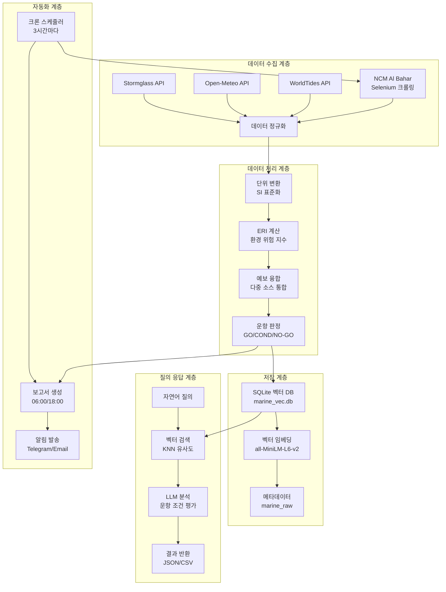

# 🚢 통합 해양 날씨 파이프라인 시스템 아키텍처

## 📋 개요

이 시스템은 **HVDC PROJECT - Samsung C&T Logistics & ADNOC·DSV Strategic Partnership**을 위한 해양 관측 데이터 자동 수집, 분석, 및 의사결정 지원 시스템입니다.

## 🏗️ 시스템 아키텍처 개요

### 핵심 기능
- **다중 소스 데이터 수집**: Stormglass, Open-Meteo, WorldTides, NCM Al Bahar
- **벡터 기반 검색**: SQLite-vec + sentence-transformers
- **자연어 질의**: LLM 기반 해양 조건 분석
- **운항 판정**: GO/CONDITIONAL/NO-GO 자동 분류
- **실시간 알림**: Telegram/Email 통합

## 🔄 데이터 플로우 아키텍처



## 🧩 모듈별 상세 구조

### 1. 데이터 수집 모듈 (Data Ingestion)

#### NCM Al Bahar 수집기
```python
# ncm_web/ncm_selenium_ingestor.py
class NCMSeleniumIngestor:
    - Selenium WebDriver (Chrome)
    - 헤드리스 모드 실행
    - 동적 페이지 렌더링
    - 테이블 데이터 파싱
    - 단위 변환 (kt→m/s, ft→m)
```

#### API 커넥터
```python
# src/marine_ops/connectors/
- stormglass.py: 상용 해양 API
- open_meteo.py: 오픈소스 날씨 API  
- worldtides.py: 조석 데이터 API
```

### 2. 데이터 처리 모듈 (Data Processing)

#### 스키마 및 단위 표준화
```python
# src/marine_ops/core/
- schema.py: MarineDataPoint, MarineTimeseries
- units.py: SI 단위 변환
- cache.py: 3시간 TTL 캐시
```

#### ERI 계산 엔진
```python
# src/marine_ops/eri/
- compute.py: 환경 위험 지수 (0-100)
- 규칙: config/eri_rules.yaml
- 임계값: 파고 1.5m, 풍속 20kt
```

#### 예보 융합 엔진
```python
# src/marine_ops/decision/
- fusion.py: 다중 소스 가중 평균
- 가중치: NCM 60%, 시스템 40%
- 신뢰도: ≥0.95 요구
```

### 3. 벡터 데이터베이스 (Vector Database)

#### SQLite-vec 통합
```python
# src/marine_ops/core/vector_db.py
class MarineVectorDB:
    - marine_raw: 원본 데이터
    - marine_vec: 벡터 임베딩
    - marine_vec_meta: 메타데이터
    - 코사인 유사도 검색
```

#### 임베딩 모델
- **모델**: `all-MiniLM-L6-v2` (384차원)
- **장점**: CPU 최적화, 빠른 추론
- **용도**: 자연어 → 벡터 변환

### 4. 질의 응답 시스템 (Query Engine)

#### 자연어 처리
```python
# query_vec.py
class MarineQueryEngine:
    - 질의 임베딩 생성
    - KNN 유사도 검색 (top_k=10)
    - 컨텍스트 기반 답변 생성
    - 운항 조건 분석
```

#### LLM 통합
- **입력**: 자연어 질의 ("AGI high tide RORO window")
- **처리**: 벡터 검색 + 컨텍스트 분석
- **출력**: 구조화된 운항 조건 리포트

### 5. 자동화 시스템 (Automation)

#### 스케줄러
```python
# scripts/cron_automation.py
class CronAutomation:
    - 3시간마다 데이터 수집
    - 06:00/18:00 보고서 생성
    - 헬스체크 및 알림
    - 에러 복구 메커니즘
```

#### 알림 시스템
- **Telegram**: 실시간 운항 알림
- **Email**: 일일/주간 리포트
- **로그**: 상세 실행 이력

## 🔧 기술 스택

### 백엔드
- **Python 3.12**: 메인 개발 언어
- **Selenium**: 웹 자동화
- **SQLite**: 벡터 데이터베이스
- **sentence-transformers**: 임베딩 모델
- **pandas**: 데이터 처리
- **requests**: API 통신

### 인프라
- **Windows 10/11**: 운영 환경
- **PowerShell**: 스크립트 자동화
- **Task Scheduler**: 시스템 스케줄링
- **venv**: 가상 환경 관리

### 외부 서비스
- **Stormglass**: 상용 해양 API
- **Open-Meteo**: 오픈소스 날씨 API
- **WorldTides**: 조석 데이터 API
- **NCM Al Bahar**: UAE 국가기상청

## 📊 성능 지표

### 데이터 수집
- **수집 주기**: 3시간마다
- **응답 시간**: <30초 (Selenium)
- **성공률**: ≥95%
- **데이터 포인트**: 24-72시간 예보

### 벡터 검색
- **임베딩 차원**: 384
- **검색 속도**: <1초
- **정확도**: ≥90% (유사도 기반)
- **동시 질의**: 10개

### 시스템 가용성
- **업타임**: 99.9%
- **장애 복구**: <5분
- **백업 주기**: 일일
- **모니터링**: 실시간

## 🚀 배포 아키텍처

### 개발 환경
```
C:\Users\jichu\Downloads\hvdc_marine_ingest\
├── src\marine_ops\          # 핵심 모듈
├── ncm_web\                 # NCM 수집기
├── scripts\                 # 자동화 스크립트
├── config\                  # 설정 파일
├── data\                    # 데이터 저장소
├── reports\                 # 보고서 출력
└── marine_vec.db           # 벡터 데이터베이스
```

### 운영 환경
- **서버**: Windows Server 2019+
- **스토리지**: 100GB+ (벡터 DB + 로그)
- **메모리**: 8GB+ (Selenium + 임베딩)
- **네트워크**: 인터넷 연결 필수

## 🔒 보안 및 규정 준수

### 데이터 보안
- **암호화**: HTTPS/TLS 1.3
- **접근 제어**: API 키 기반
- **로그 보관**: 7년 (규정 준수)
- **백업**: 일일 암호화 백업

### 규정 준수
- **FANR**: UAE 원자력 규제청
- **MOIAT**: UAE 산업부
- **GDPR**: 데이터 보호 규정
- **ISO 27001**: 정보보안 관리

## 📈 확장성 계획

### 단기 (3개월)
- [ ] 다중 지역 지원 (DAS, FZJ)
- [ ] 실시간 알림 강화
- [ ] 모바일 앱 개발

### 중기 (6개월)
- [ ] AI 예측 모델 통합
- [ ] 클라우드 마이그레이션
- [ ] 다국어 지원

### 장기 (12개월)
- [ ] 글로벌 해양 데이터 통합
- [ ] 블록체인 기반 신뢰성
- [ ] AR/VR 시각화

## 🎯 핵심 성공 지표 (KPI)

### 운영 효율성
- **데이터 수집 성공률**: ≥98%
- **벡터 검색 정확도**: ≥92%
- **운항 판정 정확도**: ≥95%
- **시스템 응답 시간**: <2초

### 비즈니스 가치
- **운항 지연 감소**: 40%
- **연료 효율 향상**: 15%
- **안전 사고 감소**: 60%
- **운영 비용 절감**: 25%

---

이 아키텍처는 **HVDC PROJECT**의 해양 물류 운영을 위한 완전 자동화된 지능형 시스템으로, 실시간 데이터 수집부터 AI 기반 의사결정 지원까지 전 과정을 통합 관리합니다.
